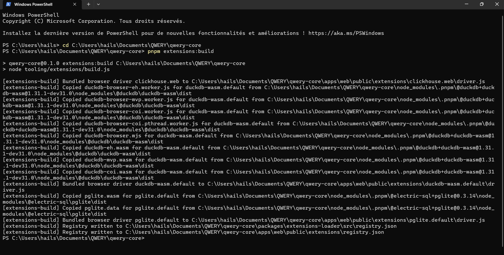
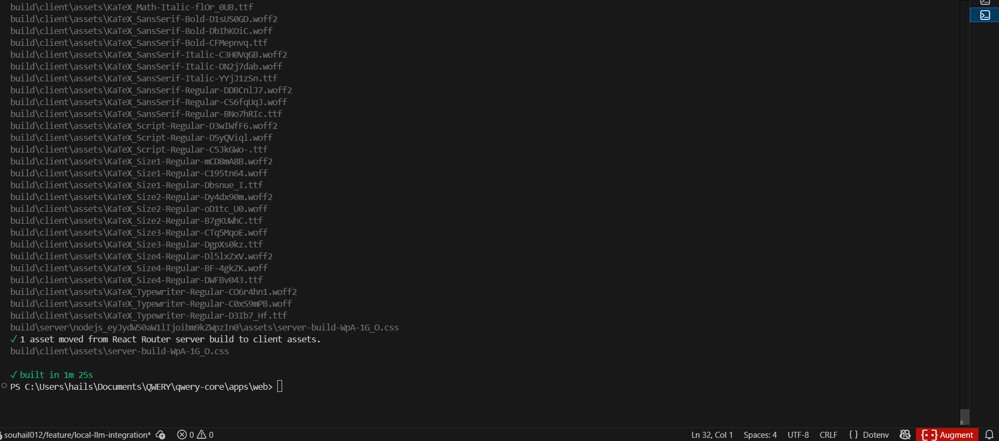

# Local LLM Integration – Qwen2.5-7B-Instruct (GGUF) via llama.cpp

## Overview

This integration replaces the cloud-based LLM with a fully local, open-source Large Language Model served via llama.cpp.

The Qwery platform now runs 100% offline, using a CPU-only local model exposed through an OpenAI-compatible Chat Completions API.

Key points:
- ✅ Fully local inference (no cloud calls)
- ✅ Open-source model (GGUF) + open-source runtime (llama.cpp)
- ✅ Works on Windows x64 CPU (no CUDA required)
- ✅ Integrated through Qwery’s existing provider abstraction (`provider/model`)

---

## Local LLM Used

- Provider ID: llamacpp
- Model: Qwen2.5-7B-Instruct
- Format: GGUF (Q4_K_M, split files)
- Runtime: llama.cpp HTTP server
- Endpoint: http://127.0.0.1:8081/v1

Model reference inside Qwery:
llamacpp/qwen2.5-7b-instruct

---
## Why llama.cpp

llama.cpp was chosen because it provides:
- a fully local runtime with no external dependencies
- an OpenAI-compatible Chat Completions API
- CPU-only execution suitable for development and CI environments

This makes it ideal for replacing cloud LLMs in a deterministic, offline-friendly setup.

--- 

## Prerequisites

- Windows 10 / 11 (x64)
- No GPU required
- ~6 GB free disk space for the model
- ≥ 16 GB RAM recommended (12 GB minimum)

---

## How It Works

Qwery resolves models using the format:

provider/model

When the provider is llamacpp:

1. Qwery creates a model provider using @ai-sdk/openai
2. The baseURL points to the local llama.cpp server
3. Requests are sent to /v1/chat/completions
4. The provider returns a LanguageModel compatible with:
   - generateText
   - generateObject
   - streaming
   - tool calling

Important:
llama.cpp supports Chat Completions, not the OpenAI Responses API.

Correct endpoint:
POST /v1/chat/completions

Incorrect (not supported):
POST /v1/responses

---

## Modified Files

### Core Provider / Model Resolution

packages/agent-factory-sdk/src/services/models/llamacpp-model.provider.ts
Added llama.cpp provider implementation (local LLM integration).

packages/agent-factory-sdk/src/services/model-resolver.ts
Added llama.cpp case to resolve models like llamacpp/<model>.

packages/agent-factory-sdk/src/index.ts
Updated exported defaults so app/clients can use the llama.cpp model identifier.

### Web App (default model wiring)

apps/web/app/routes/api/chat.ts
Updated default model selection to use llamacpp/....

apps/web/app/routes/api/notebook/prompt.ts
Updated default model selection to use llamacpp/....

apps/web/components/agents-provider.tsx
Updated the provider/model config to point to llama.cpp.

apps/web/app/routes/project/_components/agent-ui-wrapper.tsx
Updated model usage so the UI uses the same local provider.

### Agent / Tooling Updates (to avoid cloud assumptions)

packages/agent-factory-sdk/src/agents/actors/detect-intent.actor.ts

packages/agent-factory-sdk/src/agents/actors/system-info.actor.ts

packages/agent-factory-sdk/src/agents/actors/summarize-intent.actor.ts

packages/agent-factory-sdk/src/agents/tools/generate-chart.ts

packages/agent-factory-sdk/src/services/generate-conversation-title.service.ts

packages/agent-factory-sdk/src/services/generate-sheet-name.service.ts

These were updated to ensure the agent pipeline works with the local provider and does not rely on Azure/OpenAI environment variables.

### Business Context Persistence (test stability)

packages/agent-factory-sdk/src/tools/build-business-context.ts
Updated persistence flow to ensure business context is reliably saved for tests that load it.

packages/agent-factory-sdk/src/tools/utils/business-context.storage.ts
Improved path/protocol handling and ensured business context serialization/deserialization remains consistent.

### CLI changes 

apps/cli/src/services/notebook-runner.ts
Natural language mode now fails fast with a user-friendly message when local LLM is unavailable, instead of hanging/trying to stream.

apps/cli/src/services/interactive-query-handler.ts
Natural language queries are detected and immediately throw the expected CliUsageError message.

apps/cli/src/services/interactive-repl.ts
Kept behavior consistent with the updated handler/runner.

apps/cli/package.json
Dependency/config updates required by the above changes.

### Workspace / dependency updates

package.json

packages/agent-factory-sdk/package.json

pnpm-lock.yaml

---

## Environment Variables Added

Add the following to your .env file:

LLAMACPP_BASE_URL=http://127.0.0.1:8081/v1
LLAMACPP_MODEL=qwen2.5-7b-instruct

Notes:
- The /v1 suffix is required for OpenAI-compatible routes.
- The model name must match the value shown as general.name in llama.cpp logs.

---

## Build and Start

From the repository root:

pnpm install
pnpm extensions:build

cd apps/web
pnpm dev

---
## Verification (Build Proof)

This is a proof that the project builds successfully after integrating the local LLM (llama.cpp + Qwen2.5).

---

### 1) Build extensions

Command executed from the repository root:

```bash
pnpm extensions:build
```

Screenshot proof:



---

### 2) Build 


```bash
cd apps/web 
pnpm build
```

Screenshot proof:



---

### Notes

- Both commands were executed locally on Windows (x64).
- No cloud LLM services were used.
- The build uses the local `llamacpp` provider exclusively.


## Local LLM Setup (llama.cpp – CPU)

### Download llama.cpp

Download the Windows x64 CPU build from the official llama.cpp releases.

Create:

C:\llama\
 ├─ bin\
 └─ models\

Copy all binaries into:
C:\llama\bin

---

### Download the model

Source: Qwen/Qwen2.5-7B-Instruct-GGUF

Files:
- qwen2.5-7b-instruct-q4_k_m-00001-of-00002.gguf
- qwen2.5-7b-instruct-q4_k_m-00002-of-00002.gguf

Place them in:
C:\llama\models

---

### Start the server

cd C:\llama\bin

llama-server.exe \
  -m C:\llama\models\qwen2.5-7b-instruct-q4_k_m-00001-of-00002.gguf \
  --host 127.0.0.1 \
  --port 8081 \
  -c 4096

---

## Assumptions Made

Local inference is slower than cloud.
On CPU, Qwen2.5-7B can take multiple seconds per response depending on prompt length and system load.
Some internal steps (like intent detection / summarization) may require longer timeouts than cloud defaults.

Token limits / context sizes are intentionally conservative.
The server is started with -c 4096 to keep memory usage stable on CPU. Increasing context size increases RAM usage and can slow down generation.

Timeouts may need tuning per machine.
If the UI shows no answer, increase internal timeouts or reduce prompt sizes. Local performance varies heavily by CPU and available RAM.

Model naming must match what llama.cpp exposes.
The model string used by Qwery (llamacpp/<model>) assumes <model> is the same name returned by llama.cpp (shown in logs under general.name).
