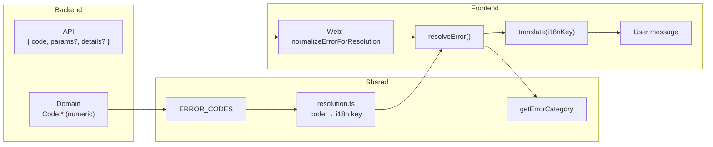

# Error Handling — Architecture & How-To

This doc is for **developers** who need to understand how errors flow from backend to user, and **how to add a new error key and user-facing message**.

---

## At a glance

- **Contract:** Backend returns `{ code: number, params?, details? }` + HTTP status. `details` is **internal-only** (debugging); it is **stripped in production** so database/driver messages never reach end users. Frontend resolves code/status to a **user-facing message** via shared resolution + i18n.
- **Flow:** Domain (numeric codes) → Shared (code → i18n key) → Web/UI (translate key → message). Raw errors without a code are normalized in the web app (e.g. RLS/Postgres phrases) before resolution.
- **Adding an error:** Define code in domain → register in shared → add i18n key (convention or override) → add translation in `common.json`. CI checks that every code has a key in `common.json`.

### 500 vs 502/503 — downstream failures

Use a **separate path** for known downstream/infrastructure failures so they are not all returned as 500:

| Status | When to use | Domain code | User category |
|--------|--------------|-------------|----------------|
| **500** | Unexpected server bug, unhandled exception, logic error | `Code.INTERNAL_ERROR` | generic |
| **502** | Downstream returned invalid response (proxy/gateway semantics) | `Code.BAD_GATEWAY_ERROR` | network |
| **503** | Downstream unavailable (DB, driver, external API down or unreachable) | `Code.SERVICE_UNAVAILABLE_ERROR` | network |

- **Backend:** In route or service code, when the failure is clearly from a **downstream dependency** (DB connection, driver error, external HTTP call), throw `DomainException` with `Code.SERVICE_UNAVAILABLE_ERROR` (or `Code.BAD_GATEWAY_ERROR` for invalid upstream response). `handleDomainException` maps those codes to HTTP 503 (or 502).
- **Frontend:** Status 502/503 (and code 502/503) are categorized as `network`; resolution uses the same category defaults or the specific i18n keys `common:errors.badGateway` / `common:errors.serviceUnavailable` for a distinct “service unavailable” message.

---

## Three error channels

The system has **three distinct error domains**. Do not mix them.

| Channel | Owner | Granularity | User intent | Goes through global resolution? |
|--------|--------|-------------|-------------|----------------------------------|
| **1. Form validation** | Frontend | Specific, field-level | Guide correction | **No** |
| **2. API (business) errors** | Backend | Specific (codes) | Inform | Yes — `getErrorKey` / `resolveError` |
| **3. Transport errors** | Frontend | Coarse (category) | Inform | Yes — category-based |

**Validation (Channel 1)** is not “something failed” — it’s “you need to fix this input.” It must **not** enter the global error pipeline (`ApiError`, `resolveError`, toasts from `getErrorKey`). Keep it **local**: `formState.errors`, field-level messages, or at most a fixed submit toast (“Please fix the errors below”) that does **not** call `getErrorKey`. Validation does not get numeric codes or ERROR_CODES; it stays client-owned and field-bound.

**API errors (Channel 2)** and **transport errors (Channel 3)** are the only things that should go through `getErrorKey` / `resolveError`. If validation is routed there, it gets flattened into generic categories — that’s a design smell. Fix the call site so validation stays in Channel 1.

---

## Architecture



### Who owns what

| What | Where |
|------|--------|
| Numeric codes + dev message | `packages/domain/src/common/code.ts` |
| Code → i18n key (convention + overrides) | `packages/shared/src/error/` (`codes.ts`, `resolution.ts`, `overrides.ts`) |
| Error category (notFound, permissionDenied, network, generic) | `packages/shared/src/error/codes.ts` |
| User-facing message text | `apps/web/lib/i18n/locales/en/common.json` under `errors` |
| Raw-error normalization (e.g. RLS, Postgres) | `apps/web/lib/error-adapter.ts` only |
| “Show to user” in web | `getErrorKey(error, t)` in `~/lib/utils/error-key` |
| “Show to user” in UI package | `toUserFacingError(error, translate)` in `@qwery/ui/ai/user-facing-error` |

### Resolution flow (short)

1. Error has `code` → look up in `ERROR_CODES` → get property name (e.g. `NOTEBOOK_NOT_FOUND`).
2. Property name → i18n key via **convention** in `resolution.ts` or **override** in `overrides.ts` (e.g. `common:errors.notebook.notFound`).
3. Translate that key; if missing or translation fails → category key → `DEFAULT_ERROR_MESSAGES` → generic.
4. If error has no `code`/`status`, web app can normalize it first (e.g. match message to RLS/network) to a synthetic `{ status }`, then resolve as above.

### Which codes are wired (backend vs front-only)

| Source | What is wired | How it reaches resolution |
|--------|----------------|---------------------------|
| **Backend → Front** | All codes in `ERROR_CODES` (from domain `Code.*`). | Server sends `{ code, params?, details? }` via `handleDomainException`. Frontend receives them when API returns non-ok: `api-client` throws `ApiError(status, body.code, …)`. So every numeric code the user can see from an API error is **backend-origin**; the server is the only place that sends those codes. |
| **Front-only** | No numeric codes from `ERROR_CODES`. | Errors that never hit the API (network failure, timeout, client throw) have either: (1) **status + unmapped code** — e.g. `ApiError(0, 0, …)` for network, `ApiError(408, 408, …)` for timeout; resolution sees code but it’s unmapped, so it uses **status** for category (`getErrorCategoryFromStatus(status)`) and category default messages; or (2) **no code, synthetic status** — `normalizeErrorForResolution` (web) maps known phrases (RLS, Postgres, “failed to fetch”) to `{ status }`, then resolution uses status → category; or (3) **generic** — no code, no status → generic message. So front-only = **category-level** (notFound, permissionDenied, network, generic) with default messages; no code from the registry. |

**Summary:** All **codes** (numeric, with i18n keys) are **backend-origin**. Front-only errors use **categories** and default messages. When the frontend creates an `ApiError(status, code, …)` with an unmapped code (e.g. 0, 408), resolution uses **status** to pick the category so network/timeout get the right message.

### Validation errors (Zod, client-side) — Channel 1 only

Validation is **Channel 1** (see [Three error channels](#three-error-channels)). It is deterministic, user-actionable, and known before the request is sent — closer to form state than to API errors.

- **Correct design:** Validation stays **local**. Use `formState.errors` (e.g. react-hook-form + Zod) for field-level messages. For a submit-level message, use the first Zod message or a fixed i18n key (“Please fix the errors below”) — **do not** call `getErrorKey` for validation. Do **not** wrap validation in `ApiError` or send it through `resolveError`.
- **Safety net:** If a `ZodError` does reach `getErrorKey` (e.g. a catch that mixes validation and API errors), web returns the **first validation message** so the user sees “Name is required” instead of “Something went wrong.” Treat that as a fallback for misrouted validation; the right fix is to stop sending validation into the global pipeline.
- **No numeric codes for validation.** Validation is client-owned; it does not belong in ERROR_CODES or the backend contract. If you need a shared shape for validation (e.g. cross-form), use a distinct type (e.g. `{ type: 'validation', fieldErrors: Record<string, string> }`) that never mixes with `ApiError` or domain codes.

**Zod usage in this repo (audit):** Forms with `zodResolver(schema)` use `FormMessage` for field-level errors; mutation `onError` receives only API errors, not ZodErrors. Manual `safeParse` (e.g. `datasource-connect-form`) should show the first validation message via `getFirstZodValidationMessage(parsed.error)` and a local fallback (e.g. "Invalid configuration"), not `getErrorKey`. Do not send ZodErrors into the global pipeline.

---

## How to add a new error key and value

You need to touch **four places** (domain, shared, i18n key, translation). Follow the steps below; then run `pnpm validate:error-keys` to ensure the new key exists in `common.json`.

### Step 1 — Domain: define the code

**File:** `packages/domain/src/common/code.ts`

Add a `CodeDescription` with a unique numeric `code` and a **developer** message (not the user-facing copy). Use the right range (e.g. 2000–2099 for notebook, 2400–2499 for project).

```typescript
// Example: new “not found” style code in project range
public static PROJECT_ARTIFACT_NOT_FOUND_ERROR: CodeDescription = {
  code: 2450,
  message: 'Project artifact not found.',
};
```

### Step 2 — Shared: register the code

**File:** `packages/shared/src/error/codes.ts`

Re-export the code in `ERROR_CODES` so resolution can map code → property name.

```typescript
import { Code } from '@qwery/domain/common';

export const ERROR_CODES = {
  // ... existing
  PROJECT_ARTIFACT_NOT_FOUND: Code.PROJECT_ARTIFACT_NOT_FOUND_ERROR.code,
} as const;
```

### Step 3 — i18n key: convention or override

The property name (e.g. `PROJECT_ARTIFACT_NOT_FOUND`) must map to an i18n key like `common:errors.project.artifactNotFound`.

- **Option A — Convention:** If `transformPropertyNameToI18nKey()` in `packages/shared/src/error/resolution.ts` already handles this pattern (e.g. `*_NOT_FOUND` → `common:errors.<entity>.notFound`), you don’t add anything here. Check the [Convention reference](#convention-property-name--i18n-key) below for the full table.
- **Option B — Override:** If the convention doesn’t fit, add an explicit mapping in `packages/shared/src/error/overrides.ts`:

```typescript
import { ERROR_CODES } from './codes';

export const ERROR_REGISTRY_OVERRIDES: Record<number, string> = {
  // ... existing
  [ERROR_CODES.PROJECT_ARTIFACT_NOT_FOUND]: 'common:errors.project.artifactNotFound',
};
```

### Step 4 — Translation: add the user-facing message

**File:** `apps/web/lib/i18n/locales/en/common.json`

Add the key under `errors`. Use nested objects when the key has dots (e.g. `project.artifactNotFound` → `"project": { "artifactNotFound": "..." }`).

```json
{
  "errors": {
    "project": {
      "notFound": "Project not found.",
      "artifactNotFound": "Project artifact not found."
    }
  }
}
```

### Checklist

- [ ] Code added in `packages/domain/src/common/code.ts`
- [ ] Code registered in `packages/shared/src/error/codes.ts`
- [ ] i18n key: either covered by convention in `resolution.ts` or added in `overrides.ts`
- [ ] Translation added in `apps/web/lib/i18n/locales/en/common.json` under `errors`
- [ ] Run `pnpm validate:error-keys` (CI runs this in typecheck)

### Validation

From repo root:

```bash
pnpm validate:error-keys
```

This checks that every code in `ERROR_CODES` has a corresponding key present in `common.json`. If you add a code but forget the translation, CI will fail.

---

## Convention: property name → i18n key

Implemented in `packages/shared/src/error/resolution.ts`. New codes that don’t match any rule need either a new convention there or an entry in `overrides.ts`.

| Pattern | Example property name | i18n key |
|--------|------------------------|----------|
| Single word | `NOTEBOOK` | `common:errors.notebook` |
| Single word + `_ERROR` | `NOTEBOOK_ERROR` | `common:errors.notebookError` |
| Flat (BAD/WRONG/ENTITY/…) | `BAD_REQUEST` | `common:errors.badRequest` |
| Use case | `USE_CASE_PORT_VALIDATION_ERROR` | `common:errors.useCasePortValidationError` |
| Not found | `NOTEBOOK_NOT_FOUND` | `common:errors.notebook.notFound` |
| Already exists | `NOTEBOOK_ALREADY_EXISTS` | `common:errors.notebook.alreadyExists` |
| Agent / state machine | `AGENT_SESSION_NOT_FOUND` | `common:errors.agent.sessionNotFound` |
| Entity-action | `NOTEBOOK_UPDATE_ERROR` | `common:errors.notebook.updateError` |
| Fallback | (other) | camelCase of full name |

When in doubt, add an override in `overrides.ts` and the key in `common.json`.

---

## Error contract (backend)

API error body:

```typescript
{
  code: number,        // From Code.*
  params?: unknown,
  details?: string
}
```

HTTP status: `2000–2999` → 404; `400–499` → same; others → 500.

### Server helpers and global boundary

All API errors should go through `apps/server/src/lib/http-utils.ts`:

- `handleDomainException(error: unknown): Response`
  - Entry point for **all** unhandled route errors.
  - Maps `DomainException` to `{ code, params, details? }` and status as above.
  - Maps unknown errors to `{ code: 500, details? }`, status 500.
- `createValidationErrorResponse(message: string, code: CodeDescription = Code.BAD_REQUEST_ERROR): Response`
  - For request-shape / validation errors (missing query params, invalid bulk body, etc.).
  - Do **not** hand-roll `c.json({ error: ... }, 400)`. Always use this helper so the client sees a proper `{ code, params?, details? }` body.
- `createNotFoundErrorResponse(message: string, code: CodeDescription = Code.ENTITY_NOT_FOUND_ERROR): Response`
  - For “thing not found” paths that do not already throw a `DomainException` (e.g. extensions registry).
  - Keeps 404 responses consistent with the rest of the contract.

The Hono app is wired with a **global error boundary** in `apps/server/src/server.ts`:

```ts
app.onError(async (err) => {
  const logger = await getLogger();
  const traceId = getCurrentTraceId();
  logger.error(
    {
      err,
      message: err instanceof Error ? err.message : String(err),
      stack: err instanceof Error ? err.stack : undefined,
      ...(traceId ? { traceId } : {}),
    },
    'Unhandled request error',
  );
  return handleDomainException(err);
});
```

- This guarantees that any uncaught exception still returns the canonical error body.
- Logs always contain either the error code (for `DomainException`) or a 500, and optionally a `traceId` for correlation with other telemetry.

### `details` — internal-only

- **Purpose:** Debugging only (e.g. exception message, driver error). **Not safe for end users** — may contain internal or dependency messages.
- **Contract:** Backend **strips `details` in production** (`NODE_ENV === 'production'`). In development/test it may be present.
- **Frontend:** May receive `details` only in non-production. Do not rely on it for UX; use `code`/`status` + i18n for user-facing text. If you show `details` in UI (e.g. collapsible “View details”), treat it as dev-only — in production it will be absent.

### MCP tool errors — out of scope for REST contract

MCP error responses are **intentionally outside the REST contract**. They do not use `{ code, params?, details? }` and are not part of the shared resolution or i18n pipeline.

- **Shape:** Tool failures return a simple JSON payload `{ error: string }` (e.g. "Conversation not found: …", "Notebook not found: …", or exception messages). No numeric codes, no i18n keys.
- **Where produced:** `apps/server/src/lib/mcp-handler.ts` — all MCP tool handlers use `errorContent(message)` for failures. The endpoint is `POST /mcp` (see `apps/server/src/server.ts`).
- **Where consumed:** The agent runtime calls MCP tools via `packages/agent-factory-sdk` (e.g. `mcp/client.ts`, `tools/registry.ts` when `mcpServerUrl` is set). Tool results (including `{ error: string }`) are returned to the agent; the chat route (`apps/server/src/routes/chat.ts`) passes `mcpServerUrl` so the agent can use these tools. Any tool error text may later appear in the UI as tool output (e.g. in `@qwery/ui` tool visualizers); that display is **not** routed through `getErrorKey` or `resolveError`. If you need user-facing consistency, map known MCP error message patterns in the client that renders tool output, not in the MCP response.

---

## Using errors in the app

Use `getErrorKey` when you just need a translated string for a toast. Use `toUserFacingError` when you need the full error structure (key, message, details, code) for richer UI.

**Web (toast / string):**

```typescript
import { getErrorKey } from '~/lib/utils/error-key';

toast.error(getErrorKey(error, t));
```

**UI package (key + message + details):**

```typescript
import { toUserFacingError } from '@qwery/ui/ai/user-facing-error';

const { key, message, details, code } = toUserFacingError(error, translate);
```

**Low-level (shared):** Use `resolveError()` with `DEFAULT_ERROR_MESSAGES` and optional `onUnmappedCode` / `onFallbackToCategory` for observability (see [Observability](#observability)).

---

## Error categories and code ranges

- **Categories:** `notFound` | `permissionDenied` | `network` | `generic`
- **Ranges:** 400–499 HTTP client; 500 internal; 1000–1999 common; 2000–2999 not found (2100 user, 2200 workspace, 2300 org, 2400 project, 2500 datasource, 2600 agent, 2700 conversation, 2800 message).

---

## Observability

Unmapped codes and category fallbacks are **wired to the logger** so contract drift is visible instead of silent.

- **Web:** `getErrorKey()` (in `~/lib/utils/error-key`) passes `onUnmappedCode` and `onFallbackToCategory` to `resolveError()`; both fire-and-forget log via `getLogger()`.
- **UI package:** `toUserFacingError()` (in `@qwery/ui/ai/user-facing-error`) does the same.

**Log messages to search for:**

- `Error resolution: unmapped code` — backend sent a code not in `ERROR_CODES` (e.g. new code added server-side before frontend).
- `Error resolution: fallback to category (contract drift risk)` — code is known but translation failed or key missing; user saw category/generic message.

Without these logs, the system can appear stable while silently degrading (e.g. new backend code, missing i18n key, user sees generic, nobody notices). Do not remove or bypass these hooks.

- CI runs `pnpm validate:error-keys` to ensure every code has a key in `common.json`.

---

## Troubleshooting

| Symptom | What to check |
|--------|----------------|
| **CI fails with "Missing i18n key for code …"** | You added the code in domain + shared but the key is missing or wrong. Add the key to `common.json` under `errors` and ensure it matches the [convention](#convention-property-name--i18n-key) or your entry in `overrides.ts`. |
| **User sees "Something went wrong" instead of my message** | The code may not be in `ERROR_CODES`, or the i18n key doesn’t exist in `common.json`. Confirm Step 2 and Step 4; run `pnpm validate:error-keys` locally. |

---

## Related docs

- **`error-management-review.md`** — Structured architectural review (post-refactor).
- **`ERROR_HANDLING_TEST_PLAN.md`** — User-facing error testing scenarios.
- **`ERROR_FLOW_CREATE_PROJECT.md`** — Example flow for create-project errors.
- Code: `packages/shared/src/error/resolution.ts`, `packages/domain/src/common/code.ts`.
