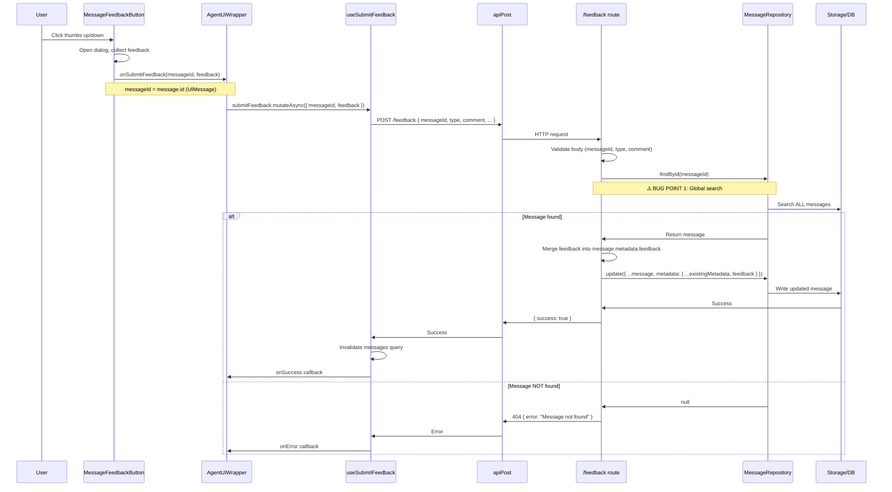

# Feedback Persistence Flow - Exact Debugging Guide

Exact flow of feedback from UI click to database persistence, with potential bug points.

---

## 1. Flow Overview



---

## 2. Critical Code Paths

### Frontend: UI → API Call

**File**: `packages/ui/src/qwery/ai/message-item.tsx`
```typescript
// Line 661-667, 785-791
<MessageFeedbackButton
  messageId={message.id}  // ⚠️ This is UIMessage.id
  onSubmitFeedback={onSubmitFeedback}
  existingFeedback={getFeedbackFromMetadata(message.metadata)}
/>
```

**File**: `apps/web/app/routes/project/_components/agent-ui-wrapper.tsx`
```typescript
// Line 502-505
const handleSubmitFeedback = useCallback(
  async (messageId: string, feedback: FeedbackPayload) => {
    await submitFeedback.mutateAsync({ messageId, feedback });
  },
  [submitFeedback],
);
```

**File**: `apps/web/lib/mutations/use-submit-feedback.ts`
```typescript
// Line 23-27
mutationFn: async (input: SubmitFeedbackInput) => {
  await apiPost('/feedback', {
    messageId: input.messageId,  // ⚠️ Sent to backend
    ...input.feedback,
  });
},
```

### Backend: API → Persistence

**File**: `apps/server/src/routes/feedback.ts`
```typescript
// Line 64, 107
const messageId = body.messageId as string | undefined;
// ...
const message = await repos.message.findById(messageId);  // ⚠️ BUG POINT 1

if (!message) {
  return c.json({ error: 'Message not found' }, 404);  // ⚠️ BUG POINT 2
}

// Line 130-137: Merge feedback into metadata
const existingMetadata: Record<string, unknown> =
  message.metadata && typeof message.metadata === 'object'
    ? (message.metadata as Record<string, unknown>)
    : {};
const updatedMetadata = {
  ...existingMetadata,
  feedback,  // ⚠️ Overwrites entire feedback object
};

// Line 139-146: Update message
const updatedMessage = {
  ...message,
  metadata: updatedMetadata,
  updatedAt: new Date(),
  updatedBy: 'feedback',
};

await repos.message.update(updatedMessage);
```

**File**: `packages/repositories/file/src/message.repository.ts`
```typescript
// Line 66-75: Global search (inefficient + potential collision)
async findById(id: string): Promise<Message | null> {
  const keys = await Storage.list([ENTITY]);  // ⚠️ ALL messages
  for (const key of keys) {
    if (key.length === 3 && key[2] === id) {  // Match by id only
      const row = await Storage.read<Row>(key);
      return deserialize(row);
    }
  }
  return null;
}
```

### Load: Database → UI

**File**: `apps/web/lib/utils/messages-converter.ts`
```typescript
// Line 39-50: Merge metadata
const contentMeta = /* from message.content.metadata */;
const rootMeta = /* from message.metadata */;

return {
  id: message.id,  // Backend ID
  role: normalizeUIRole(message.content.role),
  metadata: {
    ...contentMeta,
    ...rootMeta,  // ⚠️ Feedback is in rootMeta.feedback
    createdAt,
  },
  parts: message.content.parts,
};
```

**File**: `packages/ui/src/qwery/ai/feedback-types.ts`
```typescript
// Line 59-80: Extract feedback from metadata
export function getFeedbackFromMetadata(metadata: unknown): StoredFeedback | null {
  if (!metadata || typeof metadata !== 'object') return null;
  const meta = metadata as Record<string, unknown>;
  const feedback = meta.feedback;  // ⚠️ Reads from metadata.feedback
  // ...
}
```

---

## 3. Bug Points & Issues

### 🐛 **BUG POINT 1: Global ID Search**

**Location**: `MessageRepository.findById()`

**Problem**:
- Searches **ALL messages across ALL conversations**
- No conversation-scoped lookup
- Inefficient: O(n) scan of all message files
- **Potential collision**: If two messages in different conversations have the same ID (extremely unlikely with UUIDs, but possible with client IDs), wrong message could be found

**Impact**: Performance degradation, potential wrong message update

**Fix**: Add `findByIdInConversation(id, conversationId)` or optimize `findById` to be conversation-aware

---

### 🐛 **BUG POINT 2: Message Not Found During Streaming**

**Location**: `apps/server/src/routes/feedback.ts` line 107-111

**Problem**:
- User submits feedback **during streaming** (before `onFinish` persists message)
- `message.id` = stream UUID (from `generateMessageId: () => uuidv4()`)
- Backend `findById(streamUUID)` returns `null` because message hasn't been persisted yet
- Returns 404 "Message not found"

**Flow**:
1. Stream starts → assistant message gets `id = streamUUID` (e.g., `abc-123`)
2. User clicks feedback → `onSubmitFeedback(streamUUID, feedback)`
3. Backend `findById(streamUUID)` → **not found** (message only exists in frontend state)
4. `onFinish` callback runs → persists with **new backend UUID** (e.g., `xyz-789`)
5. Feedback fails with 404

**Impact**: **Feedback cannot be submitted during streaming** - must wait until message is persisted

**Fix Options**:
1. **Queue feedback**: Store feedback temporarily, apply when message is persisted
2. **Wait for persistence**: Delay feedback submission until `onFinish` completes
3. **Use conversation + content hash**: Find message by conversationId + content hash instead of ID
4. **Store feedback separately**: Create feedback entity linked by conversationId + message index/timestamp

---

### 🐛 **BUG POINT 3: Metadata Merge Order**

**Location**: `apps/web/lib/utils/messages-converter.ts` line 47-50

**Problem**:
- Merges `contentMeta` first, then `rootMeta`
- If `content.metadata.feedback` exists, it could override `message.metadata.feedback`
- However, feedback is stored in `message.metadata.feedback` (root), so this should be fine

**Impact**: Low - feedback is stored at root level, so merge order shouldn't matter

---

### 🐛 **BUG POINT 4: Feedback Overwrite**

**Location**: `apps/server/src/routes/feedback.ts` line 134-137

**Problem**:
- `updatedMetadata = { ...existingMetadata, feedback }` **replaces** entire feedback object
- If user edits feedback, old feedback is lost (but this is intentional - single feedback per message)

**Impact**: By design - one feedback per message

---

## 4. Exact Persistence Flow

### Step-by-Step

1. **User clicks feedback button**
   - `MessageFeedbackButton` receives `messageId = message.id` (UIMessage.id)
   - Opens dialog, collects `FeedbackPayload`

2. **Submit feedback**
   - `onSubmitFeedback(messageId, feedback)` called
   - `messageId` = whatever `message.id` is at that moment:
     - **During streaming**: Stream UUID (from `generateMessageId`)
     - **After load**: Backend UUID (from `MessageOutput.id`)

3. **API call**
   - `POST /feedback` with `{ messageId, type, comment, positiveType/issueType }`

4. **Backend validation**
   - Validates `messageId` is non-empty string
   - Validates `type` is 'positive' or 'negative'
   - Validates `comment` is string
   - Validates `positiveType`/`issueType` based on `type`

5. **Find message**
   - `repos.message.findById(messageId)` → **global search**
   - **If not found**: Return 404

6. **Merge feedback**
   - Extract `message.metadata` (existing)
   - Create `updatedMetadata = { ...existingMetadata, feedback: { messageId, type, comment, positiveType/issueType, updatedAt } }`

7. **Update message**
   - `repos.message.update({ ...message, metadata: updatedMetadata, updatedAt, updatedBy: 'feedback' })`
   - Writes to `message/{conversationId}/{messageId}.json`

8. **Invalidate cache**
   - Frontend invalidates messages query
   - Refetches messages
   - `convertMessages()` merges metadata → feedback appears in UI

---

## 5. Debugging Checklist

When feedback doesn't persist, check:

- [ ] **Is message persisted?** Check if message exists in DB before submitting feedback
- [ ] **What is `messageId`?** Log `message.id` when feedback is submitted - is it frontend ID or backend ID?
- [ ] **Is `findById` finding the message?** Add logging in `MessageRepository.findById()`
- [ ] **Is metadata being merged correctly?** Check `message.metadata` before and after update
- [ ] **Is cache invalidation working?** Check if messages query refetches after feedback
- [ ] **Is feedback in the right place?** Verify `message.metadata.feedback` exists after update
- [ ] **Timing issue?** Is feedback submitted before `onFinish` persists the message?

---

## 6. Recommended Fixes

### Fix 1: Conversation-Scoped Lookup

```typescript
// Add to IMessageRepository
findByIdInConversation(id: string, conversationId: string): Promise<Message | null>;

// Implement in MessageRepository
async findByIdInConversation(id: string, conversationId: string): Promise<Message | null> {
  const key = messageKey(conversationId, id);
  try {
    const row = await Storage.read<Row>(key);
    return deserialize(row);
  } catch {
    return null;
  }
}
```

### Fix 2: Queue Feedback During Streaming

```typescript
// In feedback route, if message not found:
if (!message) {
  // Check if message is being streamed (conversation exists, recent timestamp)
  // Queue feedback to apply when message is persisted
  // OR return 202 Accepted with retry-after header
}
```

### Fix 3: Use ConversationId in Feedback API

```typescript
// Add conversationId to feedback request
POST /feedback {
  conversationId: string,  // Required
  messageId: string,
  ...
}

// Backend: Find by conversationId + messageId (more reliable)
const message = await repos.message.findByIdInConversation(messageId, conversationId);
```
