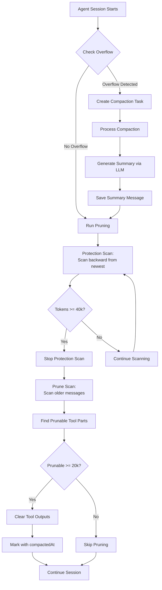

# RFC 007: Session Compaction and Pruning

## Overview

Session Compaction and Pruning are two mechanisms that manage conversation history size to prevent context window overflow and reduce database storage. They work together to ensure conversations can continue indefinitely while staying within model token limits.

## Problem Statement

As conversations grow longer, they accumulate:
- **Tool outputs**: Large query results, file contents, and other tool-generated data
- **Message history**: All previous user inputs and assistant responses

Without management, conversations would eventually exceed the model's context window limit (e.g., 128k tokens), causing failures. Additionally, storing large tool outputs indefinitely wastes database space.

## Solution: Two Complementary Mechanisms

### 1. Compaction (Summarization)

**What it does**: Replaces old conversation history with a concise summary.

**When it triggers**: Automatically when a conversation exceeds the model's usable token limit.

**How it works**:
1. Detects overflow by checking if `input tokens + cache.read + output tokens > usable limit`
2. Creates a compaction task (user message with `type: 'compaction'` part)
3. Generates a summary using an LLM that captures:
   - What was done
   - What datasources were used
   - What needs to be done next
   - Key context for continuing the conversation
4. Saves the summary as an assistant message with `metadata.summary: true`
5. Future requests skip over compacted messages and use the summary instead

**Key behavior**: The summary message is **never compacted or pruned** - it's permanent.

### 2. Pruning (Tool Output Cleanup)

**What it does**: Removes large tool output content from older messages while preserving message structure.

**When it triggers**: Runs automatically on every agent session start to proactively clean up old tool outputs.

**How it works**:
1. **Protection Phase**: Scans backward from newest messages, protecting the newest 40,000 tokens
   - Stops scanning once protection threshold is reached
   - Ensures recent, relevant context is never pruned

2. **Pruning Phase**: Scans older messages (beyond protected window)
   - Finds tool parts that are prunable (completed tool outputs)
   - Estimates token size of each part
   - Only prunes if total prunable tokens exceed 20,000 (minimum threshold)
   - Replaces tool output content with `'[Old tool result content cleared]'`
   - Marks parts with `compactedAt` timestamp to prevent re-pruning

**Key behavior**:
- Only prunes tool outputs, never user messages or assistant text
- Protects newest 40k tokens (most relevant context)
- Skips summary messages (they're never pruned)
- Skips already-pruned parts (checks `compactedAt` marker)

## Visual Flow



## Configuration

### Constants

- **`PRUNE_PROTECT`**: 40,000 tokens - Amount of newest conversation to protect from pruning
- **`PRUNE_MINIMUM`**: 20,000 tokens - Minimum tokens that must be prunable to execute pruning
- **`MAX_TOKENS_PER_PART`**: 50,000 tokens - Cap on token estimation per part (prevents wild over-estimation)

### Protected Tools

Some tools are never pruned:
- **`skill`** tool - Protected by name
- Tools with `type` starting with `'tool-'` prefix - Protected by prefix
- Parts already marked with `compactedAt` - Protected by marker

### Prunable States

Tool parts are only pruned if they're in a completed state:
- `'output-available'`
- `'output-error'`
- `'completed'`

## Token Estimation

Token estimation uses a simple formula:

```
tokens = min(ceil(text.length / 4), 50_000)
```

The `/4` ratio approximates tokens (most tokens are ~4 characters). The 50k cap prevents wild over-estimation when large objects are JSON-stringified.

## Message Filtering

When building context for the LLM, the system filters messages:

1. **Summary messages**: When a summary message is found, all messages before it are skipped (the summary replaces them)
2. **Compacted parts**: Tool parts marked with `compactedAt` have their output cleared, reducing token count
3. **Protected window**: The newest 40k tokens are always included in context

## Edge Cases

### Overshoot Protection

If a single tool output part is larger than 40k tokens, it's still protected (we don't split parts). This means protection may overshoot the target slightly, which is acceptable.

### Empty Conversations

If a conversation has no prunable tool parts, pruning does nothing and returns early.

### Already Pruned

Parts that have been pruned before (marked with `compactedAt`) are skipped automatically.

### Summary Messages

Summary messages are never scanned for pruning - they're permanent and always included in context.

## Benefits

1. **Prevents Context Overflow**: Compaction ensures conversations never exceed model limits
2. **Reduces Database Size**: Pruning removes large tool outputs from storage
3. **Maintains Relevance**: Protection window ensures newest, most relevant context is always available
4. **Automatic**: Both mechanisms run automatically without user intervention
5. **Idempotent**: Safe to run multiple times - already-processed content is skipped

## Implementation Details

### Files

- **`packages/agent-factory-sdk/src/agents/session-compaction.ts`**: Core compaction and pruning logic
- **`packages/agent-factory-sdk/src/agents/agent-session.ts`**: Orchestrates compaction task creation and pruning execution

### Key Functions

- **`isOverflow()`**: Checks if conversation exceeds model limits
- **`prune()`**: Executes pruning (protection + cleanup)
- **`process()`**: Generates and saves compaction summary
- **`create()`**: Creates compaction task message
- **`checkPrune()`**: Determines if a part is prunable
- **`getPartTokenEstimate()`**: Estimates tokens in a message part

## Example Scenario

1. **Conversation grows**: User asks many questions, agent runs many queries
2. **Overflow detected**: After 50 messages, token count exceeds 128k limit
3. **Compaction triggers**: System generates summary: "User asked about sales data, we analyzed Q1-Q4, created 5 charts..."
4. **Summary saved**: Summary message replaces old history
5. **Pruning runs**: System scans messages, protects newest 40k tokens, prunes older tool outputs
6. **Result**: Conversation continues with summary + recent context, old tool outputs cleared

## Future Considerations

- **Reasoning tokens**: Currently not included in overflow calculation - may need adjustment
- **Selective pruning**: Could prune based on recency or importance, not just token count
- **Compression**: Could compress tool outputs instead of clearing them entirely

