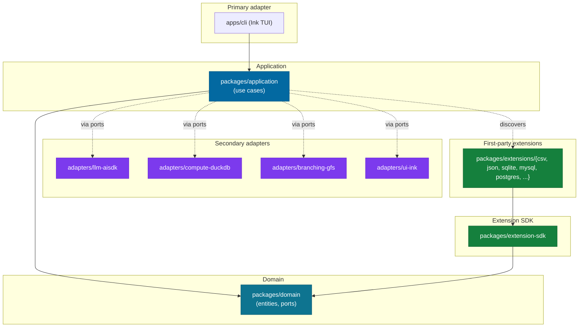

# Architecture — Hexagonal Map

Layers as per ADR #12 and the target layout in `AGENTS.md` §3.

**Rules** (enforced by `dependency-cruiser`):
- `domain` depends on **nothing** in this repo.
- `application` depends only on `domain`.
- `adapters/*` depend on `domain` (via ports) and external libs. Never on `application`.
- `apps/cli` depends on `application` and `adapters/*`.
- `extensions/*` depend only on `extension-sdk`, which depends only on `domain`.
