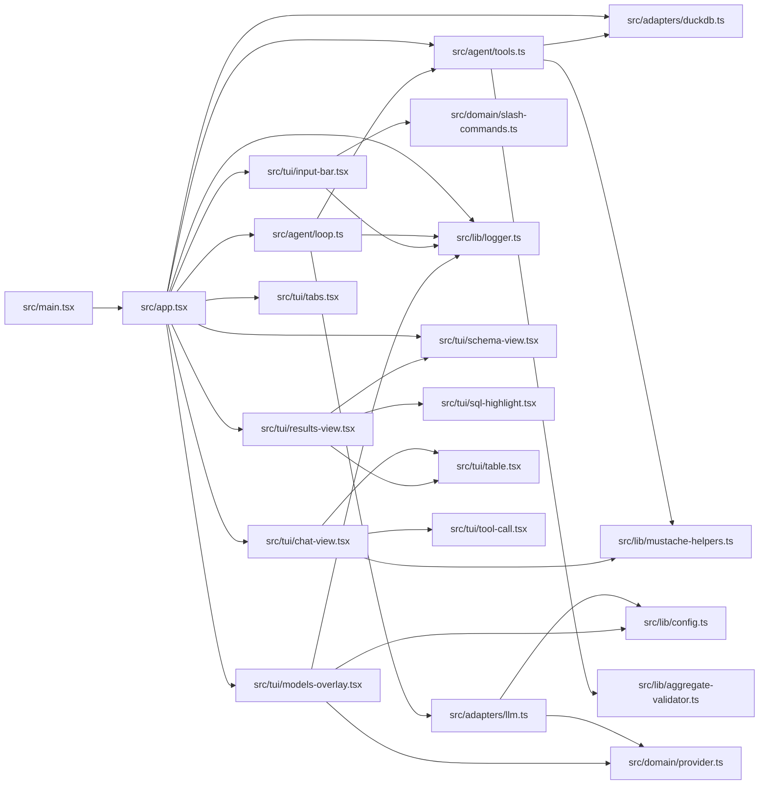

# Package dependency graph

> Auto-generated by `dependency-cruiser` — do not hand-edit.
>
> Refresh with: `bun x depcruise --include-only "^src" --output-type mermaid src`
>
> Will become a real package graph after the monorepo restructure.

