# Privacy boundary

ADR #28 — the LLM never receives row-level data.
ADR #31 — the invariant is enforced by `tooling/privacy-check.ts` in pre-push and CI.

```mermaid
flowchart LR
  subgraph Local["Local trust zone (no leak)"]
    Duck[(DuckDB engine)]
    Rows["Row values"]
    Render["Mustache renderer"]
    UI["TUI — Chat + Results"]
  end

  subgraph Boundary["Privacy boundary"]
    direction TB
    SchemaOut["columns + types"]
    SchemaQuery["columns + types"]
    AggOut["aggregate scalar<br/>(validated, ≤ 1 row, agg fns only)"]
    Ack["{ ok, rowCount }"]
  end

  subgraph Remote["LLM (untrusted for data)"]
    Model["Cloud or local model"]
  end

  Duck -- "describeSql(sql)" --> SchemaQuery
  Duck -- "DESCRIBE" --> SchemaOut
  Duck -- "validated agg query" --> AggOut
  Duck -- "rows" --> Render
  Render --> UI

  SchemaOut --> Model
  SchemaQuery --> Model
  AggOut --> Model
  Render -. "{{ rendered string }}" .-> UI

  Model -- "tool calls only" --> Boundary
  Boundary -. "never crosses" .-> Rows

  Render -- "renders locally" --> Ack
  Ack --> Model

  classDef leak fill:#dc2626,color:#fff,stroke:#991b1b
  classDef safe fill:#16a34a,color:#fff,stroke:#166534
  class Rows leak
  class SchemaOut,SchemaQuery,AggOut,Ack safe
```

**The three privacy-safe channels** (always pass through):
1. `schema(target)` → column metadata
2. `describeQuery(sql)` → output column metadata via `PREPARE`
3. `present(...)` → returns only `{ ok, rowCount }`; rendered output goes to the user, not the model

**The single auditable leak** (intentional, validated):
- `runQuery(sql)` returns one scalar row, every column an aggregate function.
  Validator: `tooling/privacy-check.ts` + `src/lib/aggregate-validator.ts`.
