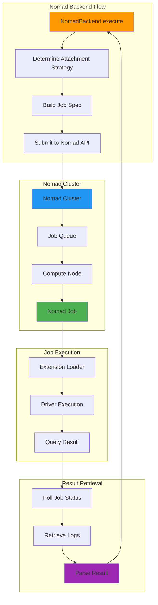
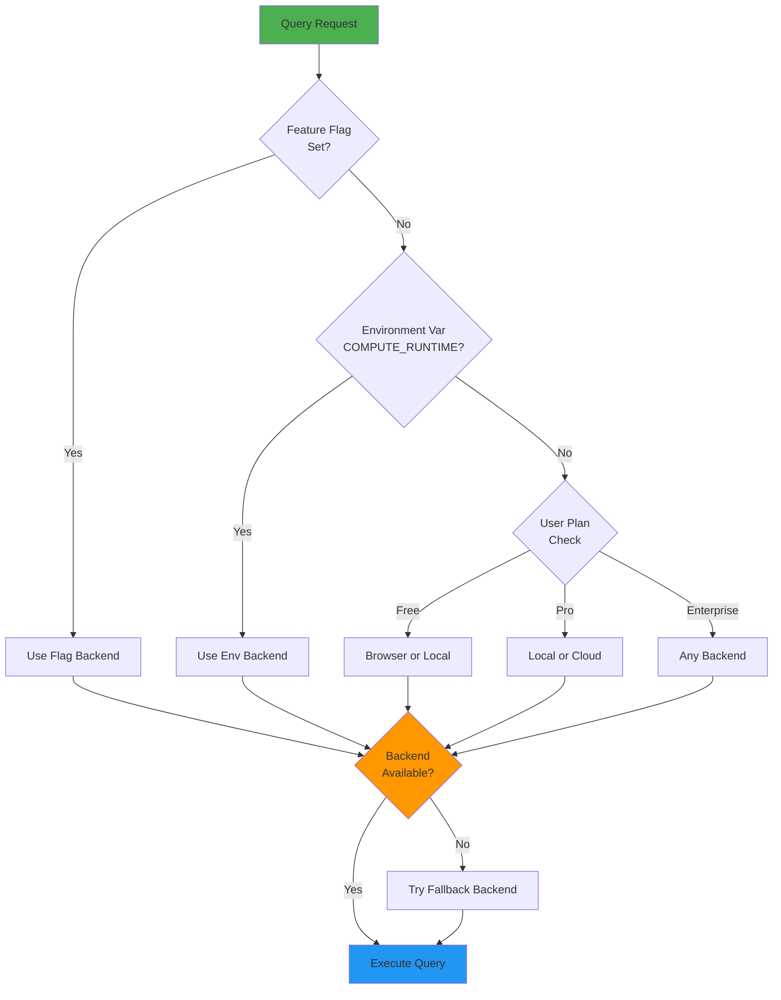
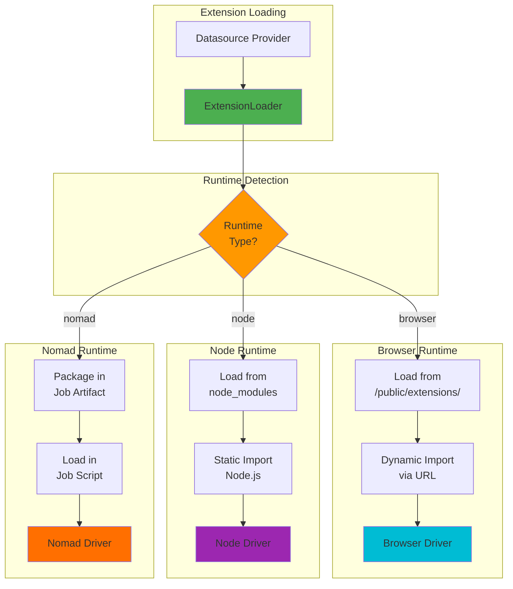
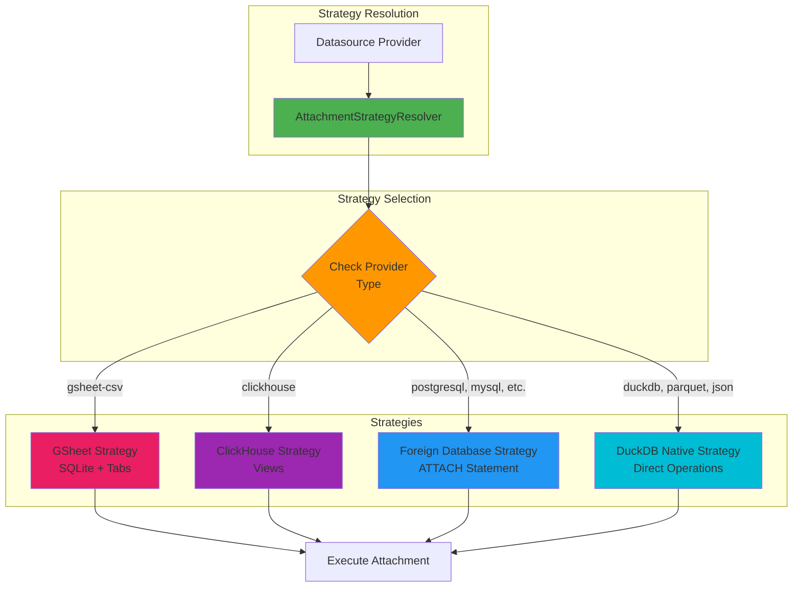
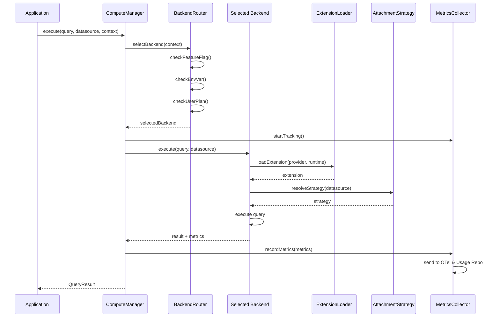
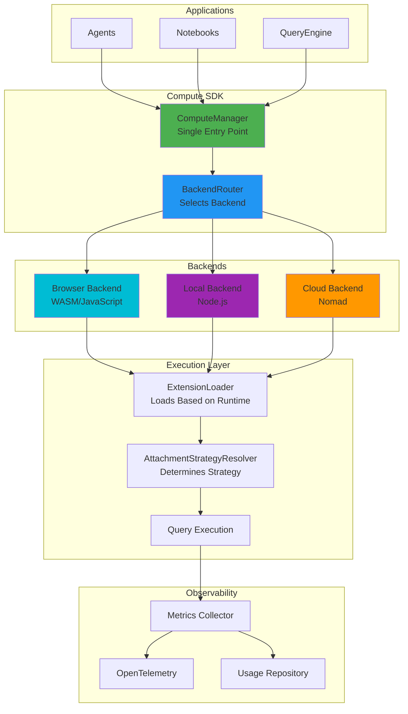

# Compute SDK

Unified abstraction for executing queries across Browser, Local, and Cloud compute backends.


## What is Compute SDK?

Compute SDK provides a single interface to execute queries regardless of where they run. Instead of handling browser vs node vs cloud execution separately, you use one API and the SDK routes to the right backend automatically.

## The Problem It Solves

**Before:** Different code paths for different execution contexts
- Agents used DuckDBQueryEngine directly
- Notebooks checked runtime and called different APIs
- No way to switch backends without code changes
- Inconsistent metrics and error handling

**After:** Single interface for all execution
- One API for all backends
- Automatic backend selection via configuration
- Consistent metrics and error handling
- Easy to add new backends

## Three Backends Explained

### Browser Backend
**What it is:** Executes queries in the user's browser using WASM or JavaScript

**When to use:**
- Embedded datasources (DuckDB WASM, PGlite)
- Small to medium queries
- Privacy-sensitive data (stays in browser)
- No server needed

**How it works:**
- Loads extensions from `/public/extensions/` directory
- Runs queries directly in browser
- Results returned immediately
- Limited by browser memory (~100-500MB)

**Example use cases:**
- User exploring local CSV files
- Small PostgreSQL queries via browser driver
- DuckDB WASM queries

### Local Backend
**What it is:** Executes queries on the local machine using Node.js

**When to use:**
- CLI applications
- Development and testing
- Direct database connections
- Large queries needing more resources

**How it works:**
- Loads extensions from `node_modules`
- Runs queries in Node.js process
- Full access to machine resources
- No network latency

**Example use cases:**
- CLI tool querying production databases
- Local development with large datasets
- Testing queries before deploying

### Cloud Backend (Nomad)
**What it is:** Executes queries in cloud infrastructure via Nomad jobs

**When to use:**
- Production workloads
- Scalable compute needs
- Isolated execution environments
- Resource-intensive queries

**How it works:**
- Packages extension code into Nomad job
- Submits job to Nomad cluster
- Job runs on compute nodes
- Retrieves results from job logs
- 1-5 second startup time, scales infinitely

**Example use cases:**
- Large analytical queries
- Multi-datasource federated queries
- Production notebook execution
- Scheduled query jobs



## How Backend Selection Works

The SDK selects backends in this priority order:

1. **Feature Flag** (highest priority) - For testing/overrides
2. **Environment Variable** (`COMPUTE_RUNTIME`) - For deployment control
3. **User Plan** - Free users get Browser/Local, Pro gets Cloud access
4. **Default** - Falls back to Local

You can override at any level, making it easy to test different backends.



## Extension Loading

Extensions are loaded differently based on runtime:

**Browser:** Extensions bundled for browser, loaded from `/public/extensions/` via dynamic imports

**Node:** Extensions loaded from `node_modules` using standard Node.js module resolution

**Nomad:** Extensions packaged into the job artifact, loaded when job starts

The SDK handles all of this automatically - you don't need to think about it.



## Attachment Strategies

Different datasources attach to query engines differently:

**Foreign Databases** (PostgreSQL, MySQL, etc.)
- Uses DuckDB's `ATTACH` statement
- Creates connection to remote database
- Tables accessible as `databasename.schema.tablename`

**Google Sheets**
- Creates persistent SQLite database
- Fetches spreadsheet tabs and creates tables
- Requires conversationId and workspace for persistence

**ClickHouse**
- Similar to foreign databases but with ClickHouse-specific handling
- Creates views for ClickHouse tables

**Native DuckDB**
- Direct DuckDB operations
- No external connection needed
- Files attached via DuckDB native functions

The SDK automatically determines the right strategy based on datasource type.



## Configuration

### Environment Variables

```bash
# Select compute backend
COMPUTE_RUNTIME=browser|local|nomad

# Nomad configuration (when using nomad backend)
NOMAD_ADDR=10.0.4.10:4646
NOMAD_TOKEN=your-token-here
NOMAD_DC=us-west-aws
NOMAD_NODE_POOL=us-west-aws
```

### Runtime Selection

Set `COMPUTE_RUNTIME` before creating ComputeManager. The SDK uses this to route queries to the correct backend.

## Usage

Create a ComputeManager and call `execute()` with your query and datasource. The SDK handles everything else:

- Backend selection
- Extension loading
- Attachment strategy
- Error handling
- Metrics collection

Results are always in the same format regardless of backend.

### Query Execution Flow



## Integration Points

**Agents:** Replace direct DuckDBQueryEngine calls with ComputeManager

**Notebooks:** Replace manual runtime checking with ComputeManager

**QueryEngine:** Use ComputeManager for federated queries, direct DuckDB for simple queries

**CLI:** Replace direct driver calls with ComputeManager

All integrations use the same API, making code consistent across the codebase.

## Metrics & Billing

The SDK automatically tracks:
- Execution time per backend
- Rows processed
- Memory usage (where available)
- Cost estimates (for cloud backends)

Metrics go to:
- OpenTelemetry for observability
- Usage Repository for billing

No manual tracking needed.

## Error Handling

The SDK handles errors consistently:
- Backend unavailable → tries fallback backends
- Extension not found → clear error message
- Query failed → structured error with context
- Network errors → automatic retries (for cloud backends)

All errors include context about which backend and datasource were used.

## Architecture Overview



## Key Benefits

**For Developers:**
- One API to learn
- Consistent error handling
- Easy to test different backends
- No need to understand extension loading details

**For Operations:**
- Easy to switch backends via environment variables
- Centralized metrics collection
- Consistent observability across all backends

**For Users:**
- Transparent backend selection
- Optimal performance (right backend for the job)
- Reliable execution (automatic fallbacks)

## Future Backends

The architecture supports adding new backends easily:
- Kubernetes (container-based execution)
- Lambda (serverless functions)
- Azure Functions
- Google Cloud Functions

Each backend implements the same interface, so adding new ones doesn't require changing application code.

## Summary

Compute SDK abstracts away the complexity of executing queries across different environments. You write code once, configure the backend via environment variables, and the SDK handles routing, extension loading, attachment strategies, and metrics collection automatically.

Whether your query runs in a browser, on a local machine, or in the cloud, the API and results are identical. This makes the codebase simpler, more maintainable, and easier to extend.
